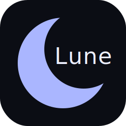

[](https://github.com/AristoRap/lune/actions/workflows/specs.yml)
[](https://github.com/AristoRap/lune/tags)
[](LICENSE)
[](https://crystal-lang.org)

<div style="width: 100%; background: #0B0D14; border-radius: 12px;">
  <p align="center">
    
  </p>
</div>

# Lune

Build native desktop apps with Crystal and a web frontend.

Lune wraps a native WebView and lets you call Crystal code from JavaScript over a typed bridge — no servers, no IPC boilerplate. Think Wails or Tauri, but for Crystal.

## Prerequisites

- [Crystal](https://crystal-lang.org) >= 1.20.0
- [Node.js](https://nodejs.org) (for the frontend build)
- The Lune CLI — see below

## Platform support

| Platform | Dev (`lune dev`)         | Build (`lune build`)    |
| -------- | ------------------------ | ----------------------- |
| macOS    | ✅                       | ✅                      |
| Linux    | ✅                       | ✅                      |
| Windows  | ⚠️ requires manual setup | ⚠️ untested (see below) |

### Windows

Windows support is incomplete. The development workflow can be made to work with manual steps, but production builds are blocked by a fundamental Crystal-on-Windows limitation.

#### Manual setup required: WebView2

The `naqvis/webview` shard's postinstall script is Unix-only. Before running `shards install`, fetch the WebView2 SDK manually:

1. Download the [WebView2 NuGet package](https://www.nuget.org/packages/Microsoft.Web.WebView2) and extract `build/native/include/WebView2.h` into `lib/webview/ext/`.
2. Build `webview.dll` and `webview.lib` with MSVC `cl.exe` against that header.
3. Copy `webview.dll`, `webview.lib`, and `WebView2Loader.dll` into a directory listed in `CRYSTAL_LIBRARY_PATH`.
4. Then run: `shards install --skip-postinstall` (Lune passes this flag automatically on Windows).

#### Webview thread isolation

`wv.run()` blocks its calling thread inside WebView2's native message loop. On Windows this means the C event loop must own a dedicated OS thread, otherwise Crystal's IO scheduler never gets CPU time and any concurrent work (HTTP server, file watcher, etc.) stalls.

Lune addresses this with `Fiber::ExecutionContext::Isolated`, which runs the entire webview setup and event loop on its own thread.
Thanks to Crystal core team for the suggestion on Reddit — see the [ExecutionContext API docs](https://crystal-lang.org/api/1.20.1/Fiber/ExecutionContext.html).

**This fix is untested on real Windows hardware.** The project is developed on macOS and Windows CI only runs a type-check (`--no-codegen`) because webview `.lib` linking is not supported in the CI environment. If you have a Windows machine and can test this, feedback and bug reports are very welcome.

## Disclaimer

While in v0.x, both the Lune lib and LuneCLI are subjected to changes.
I don't have any major re-writes planned, but if you use this now, please keep in mind that the APIs and features will possibly change.

## Getting the CLI

**Pre-built binaries** are attached to each [GitHub release](https://github.com/AristoRap/lune/releases):

| Platform              | File                 |
| --------------------- | -------------------- |
| macOS (Apple Silicon) | `lune-darwin-arm64`  |
| macOS (Intel)         | `lune-darwin-x86_64` |
| Linux x86_64          | `lune-linux-x86_64`  |

Download the binary for your platform, `chmod +x` it, and place it somewhere on your `PATH` (e.g. `/usr/local/bin/lune`).

**Or build from source:**

```sh
git clone https://github.com/aristorap/lune
cd lune
make setup        # shards install

make deploy       # build release binary → /usr/local/bin/lune

# or run without installing:
crystal run bin/lune.cr -- <command>
```

## Quick start

With the CLI on your PATH:

```sh
lune init my_app
cd my_app
lune dev
```

`lune init` scaffolds a Crystal entry point, a Vite frontend, and a `lune.yml` project config. `lune dev` compiles your Crystal app and starts the frontend dev server together, with hot-reload on source changes. If compilation fails, a dedicated error window opens showing the Crystal compiler output and closes automatically on the next successful build. See [examples/main.cr](examples/main.cr) for what the generated entry point looks like.

## Adding Lune to an existing project

Add it to your `shard.yml`:

```yaml
dependencies:
  lune:
    github: aristorap/lune
    version: ~> 0.3
```

```sh
shards install
```

You still need the CLI for `lune dev` and `lune build` — see [Getting the CLI](#getting-the-cli).

## Crystal API

### `Lune.run`

Create a `Lune::App`, install your bindings, then call `Lune.run`. The block receives an `opts` object for window configuration.

```crystal
require "lune"

app = Lune::App.new
app.install(MyModule.new)

Lune.run(app, assets: "frontend/dist") do |opts|
  opts.title      = "My App"
  opts.width      = 1200
  opts.height     = 800
  opts.min_width  = 800
  opts.min_height = 600
  opts.debug      = false
  opts.on_load     = -> { puts "page loaded" }
  opts.on_navigate = ->(url : String) { puts "navigated to #{url}" }
  opts.on_close    = -> { puts "window closed" }
end
```

**`assets:`** is an optional compile-time keyword that embeds a directory into the binary. Omit it if you're loading from a dev server or an explicit URL (see navigation priority below).

**Navigation priority** (first match wins):

1. `LUNE_DEV_URL` env var — set automatically by `lune dev`
2. `assets:` — directory embedded at compile time, served over a local HTTP server
3. `html:` / `url:` — for programmatic use via `Lune::Runner` directly (see below)

**Available `opts` properties:**

| Property      | Type               | Default  | Description                             |
| ------------- | ------------------ | -------- | --------------------------------------- |
| `title`       | `String`           | `"Lune"` | Window title                            |
| `width`       | `Int32`            | `1200`   | Initial width                           |
| `height`      | `Int32`            | `800`    | Initial height                          |
| `min_width`   | `Int32?`           | `nil`    | Minimum width                           |
| `min_height`  | `Int32?`           | `nil`    | Minimum height                          |
| `max_width`   | `Int32?`           | `nil`    | Maximum width                           |
| `max_height`  | `Int32?`           | `nil`    | Maximum height                          |
| `resizable`   | `Bool`             | `true`   | Allow resizing; `false` fixes the size  |
| `debug`       | `Bool`             | `false`  | Enable WebView devtools                 |
| `on_load`     | `(-> Nil)?`        | `nil`    | Called once when the page `load` event fires (DOM ready) |
| `on_navigate` | `(String -> Nil)?` | `nil`    | Called on every navigation (URL as arg) |
| `on_close`    | `(-> Nil)?`        | `nil`    | Called after the window closes          |

### Using `Lune::Runner` directly

For programmatic navigation (`html:` or `url:`) or finer control, use `Runner` instead of the macro:

```crystal
runner = Lune::Runner.new(app) do |opts|
  opts.title = "My App"
end

runner.start(html: "<h1>Hello</h1>")
# or: runner.start(url: "http://localhost:3000")
```

### Binding Crystal to JavaScript

#### `Lune::Bindable` — annotation-driven (recommended)

Annotate methods with `@[Lune::Bind]` and include `Lune::Bindable`. The `install` method is generated automatically from your method signatures:

```crystal
class GreetModule
  include Lune::Bindable

  @[Lune::Bind]
  def greet(msg : String) : String
    "Hello, #{msg}!"
  end

  @[Lune::Bind(async: true)]
  def slow_echo(msg : String) : String
    sleep 1.second
    "(delayed) #{msg}"
  end
end

app = Lune::App.new
app.install(GreetModule.new)

Lune.run(app, assets: "frontend/dist") do |opts|
  opts.title = "My App"
end
```

- Argument types are derived from your Crystal method signatures — no manual JSON conversion needed.
- `async: true` runs the method in a Crystal fiber, off the webview's main thread. Use it for anything that does I/O or sleeps — `async: false` (the default) runs the callback directly on the main thread and will freeze the UI if it blocks.
- The **Crystal class name** becomes the JS namespace: `GreetModule` → `api.GreetModule.*`.
- Crystal method names are camelcased: `slow_echo` → `SlowEcho`.

Nested namespaces work via `::`: a class `Math::Trig` maps to `api.Math.Trig.*` in JS.

#### `Lune::Installable` — manual (low-level)

For full control, implement `install` yourself:

```crystal
class GreetModule
  include Lune::Installable

  def install(app : Lune::App)
    app.bind(
      name: "greet",
      namespace: "GreetModule",
      args: ["String"],
      return_type: "String",
      async: false,
    ) do |args|
      JSON::Any.new("Hello, #{args[0].as_s}!")
    end
  end
end
```

`Bindable` includes `Installable`, so both work anywhere an `Installable` is expected.

### Raising errors from bindings

When a binding raises an unhandled exception, the JS Promise rejects with an object containing `code` and `error` fields:

```js
try {
  await api.MyModule.DoSomething()
} catch (e) {
  console.log(e.code)  // "error" for generic exceptions
  console.log(e.error) // the exception message
}
```

To give the JS side a machine-readable code to branch on, raise `Lune::Error` with an explicit code:

```crystal
class NotFoundError < Lune::Error
  def initialize(msg : String)
    super("not_found", msg)
  end
end

@[Lune::Bind]
def find_user(id : Int32) : String
  raise NotFoundError.new("user #{id} not found") unless id > 0
  "Alice"
end
```

```js
try {
  await api.MyModule.FindUser(-1)
} catch (e) {
  if (e.code === "not_found") {
    showNotFoundUI()
  }
}
```

The `LuneError` TypeScript interface is exported from `runtime.d.ts`:

```ts
import type { LuneError } from "../lunejs/runtime/runtime.js"
```

### Events (Crystal → JS)

Push events from Crystal to the frontend at any time — from a background fiber, a timer, or after a binding returns:

```crystal
# emit with any JSON-serializable data
app.emit("status", "ready")
app.emit("progress", {step: 3, total: 10})

# fire from a background fiber
spawn do
  loop do
    sleep 1.second
    app.emit("tick", Time.utc.to_s)
  end
end

Lune.run(app, assets: "frontend/dist") do |opts|
  opts.title = "My App"
end
```

`app.emit` can be called before or after `Lune.run` is entered; events fired before the bridge is ready are silently dropped (bridge is `nil` until the window opens).

## JavaScript API

Lune generates `<frontend.dir>/lunejs/app/App.js` from your registered bindings (e.g. `ui/lunejs/` if `frontend.dir: ui`). Import `api` for a fully dynamic proxy:

```js
import api from "../lunejs/app/App.js";

// namespace = class name, method name is camelcased
const msg = await api.GreetModule.Greet("world");
const echo = await api.GreetModule.SlowEcho("hi");
```

Named namespace objects are also exported directly:

```js
import { GreetModule } from "../lunejs/app/App.js";
const msg = await GreetModule.Greet("world");
```

All bindings return `Promise`. Exceptions thrown in Crystal reject the promise.

### Runtime functions

`runtime.js` exports built-in system functions:

```js
import { quit, openURL, environment } from "../lunejs/runtime/runtime.js";

await quit(); // terminate the app
await openURL("https://example.com"); // open in system browser
const env = await environment(); // { os, arch, debug }
```

`environment()` returns a `LuneEnvironment` object:

```ts
interface LuneEnvironment {
  os: "darwin" | "linux" | "windows";
  arch: string; // "arm64" | "x86_64"
  debug: boolean;
}
```

### Listening to events from Crystal

Import `on`, `once`, or `off` from `runtime.js` to subscribe to events emitted by `app.emit`:

```js
import { on, once, off } from "../lunejs/runtime/runtime.js";

// persistent listener
on("status", (data) => console.log(data));

// fires once then removes itself
once("tick", (data) => console.log("first tick:", data));

// remove a specific listener
const handler = (data) => updateUI(data);
on("progress", handler);
off("progress", handler);

// remove all listeners for an event
off("progress");
```

### TypeScript

Lune generates `.d.ts` files alongside every JS file it writes:

- `runtime.d.ts` — fully typed declarations for all runtime functions and the `LuneEnvironment` interface
- `App.d.ts` — typed interface per namespace, with the correct Crystal-to-TypeScript type mapping for each binding

## lune.yml

`lune init` generates a `lune.yml` in your project root. All keys are optional — omitted values fall back to their defaults.

```yaml
name: my_app
app_entry: src/main.cr # default: src/main.cr
frontend:
  dir: frontend # default: frontend
  install: npm install # default: npm install
  build: npm run build # default: npm run build
  dev:
    cmd: npm run dev # default: npm run dev
    url: http://localhost:5173
```

`lune.yml` is the single source of truth for project paths and toolchain commands; there are no CLI flag equivalents.

## CLI

```
lune init [APP_NAME]    Scaffold a new Lune app (--template vanilla|vue, --force, --skip-existing)
lune dev   (alias: d)   Start frontend dev server + Crystal with hot-reload
lune check              Type-check without building
lune build (alias: b)   Build frontend + compile Crystal binary
lune build --release    Build with Crystal --release optimizations
lune run   (alias: r)   Launch the previously built artifact
lune doctor             Check Crystal, Node, npm, shards, and frontend deps
```

`lune dev` and `lune run` both enforce single-instance at the CLI level — a second invocation for the same app entry exits immediately with an error rather than spawning a duplicate window.

Flags:

```sh
--debug           Enable debug logging (all commands)
--release         Build with Crystal --release optimizations (lune build only)
--force       -f  Delete the app directory and reinitialize from scratch (lune init only)
--skip-existing   Skip existing files instead of failing (lune init only)
```

All project paths and toolchain commands (`app_entry`, `frontend_dir`, `dev_cmd`, `build_cmd`, `dev_url`) are configured in `lune.yml`, not via CLI flags.

### `lune build` output

```sh
lune build
# macOS  → build/bin/my_app.app
# Linux  → build/bin/my_app
```

The frontend is compiled via `build_cmd` (set in `lune.yml`) and embedded in the binary via Crystal macros — the artifact is a single self-contained file.

## Development

```sh
make setup             # shards install + npm install
make test              # crystal spec
make deploy            # build release binary + copy to /usr/local/bin
```

## Contributing

1. Fork it (<https://github.com/aristorap/lune/fork>)
2. Create your feature branch (`git checkout -b my-new-feature`)
3. Add specs for your changes (`crystal spec`)
4. Commit and push (`git commit -am 'Add feature' && git push origin my-new-feature`)
5. Open a Pull Request

## Contributors

- [Aristotelis Rapai](https://github.com/aristorap) — creator and maintainer

## License

MIT
