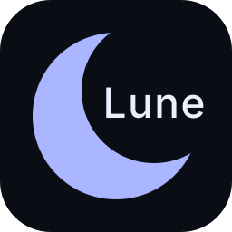

[](https://github.com/AristoRap/lune/actions/workflows/specs.yml)
[](https://github.com/AristoRap/lune/tags)
[](LICENSE)
[](https://crystal-lang.org)

<div style="width: 100%; background: #0B0D14; border-radius: 12px;">
  <p align="center">
    
  </p>
</div>

# Lune

Build native desktop apps with Crystal and a web frontend.

Lune wraps a native WebView and lets you call Crystal code from JavaScript over a typed bridge — no servers, no IPC boilerplate. Think Wails or Tauri, but for Crystal.

> **v0.x notice:** Both the library and CLI APIs may change before 1.0. If you use this now, expect occasional breaking changes.

Lune requires Crystal 1.21 or newer. Execution contexts are enabled by default in 1.21, so Lune apps no longer need experimental compiler flags.

## Documentation

Full docs live at the project `website` folder

- visit [Lune Docs](https://aristorap.github.io/lune/), or
- run `npm run docs:dev` locally from the repo (also, `make web`)

## Quick start

```sh
lune init my_app                  # vanilla JS + Vite
lune init my_app --template vue   # Vue 3 + Vite
cd my_app
lune dev
```

Pre-built CLI binaries are on the [releases page](https://github.com/AristoRap/lune/releases). Or build from source: `make setup && make deploy`.

The `demo/` directory in this repo is a Vue 3 showcase that exercises every Lune plugin. Run it with `cd demo && lune dev`. See [Plugins](https://aristorap.github.io/lune/plugins/) for the full list of what's available.

## Platform support

| Platform | Dev | Build | Notes                                                                                                      |
| -------- | --- | ----- | ---------------------------------------------------------------------------------------------------------- |
| macOS    | ✅  | ✅    | Native AppKit                                                                                              |
| Linux    | ✅  | ✅    | GTK + WebKit2GTK                                                                                           |
| Windows  | 🟡  | 🟡    | Win32 + WebView2 on Crystal 1.21+. Several plugins still gapped — see [WINDOWS_SETUP.md](WINDOWS_SETUP.md) |

### Windows

Lune runs on Windows with the standard Crystal 1.21+ MSVC toolchain; the upstream `Process` fix in [crystal#16933](https://github.com/crystal-lang/crystal/pull/16933) removes the former stdlib patch. The demo runs end-to-end via `lune dev --debug`. For per-plugin Windows status (verified, partial, not implemented), see the **Platform notes** section on each [plugin page](website/plugins/). [ROADMAP.md](ROADMAP.md) tracks the path to full parity.

## Development

```sh
make setup   # shards install + npm install
make test    # crystal spec
make deploy  # build release binary → /usr/local/bin/lune
```

On Windows, use `./make.ps1 <target>` from PowerShell — same targets as the Makefile, plus MSVC env auto-bootstrap (`./make.ps1 help` lists them). See [WINDOWS_SETUP.md](WINDOWS_SETUP.md) for the one-time native-deps setup (sqlite3 + webview).

## Contributing

1. Fork it (<https://github.com/aristorap/lune/fork>)
2. Create your feature branch (`git checkout -b my-new-feature`)
3. Add specs for your changes (`crystal spec`)
4. Commit and push and open a Pull Request

## Contributors

- [Aristotelis Rapai](https://github.com/aristorap) — creator and maintainer

## License

MIT
